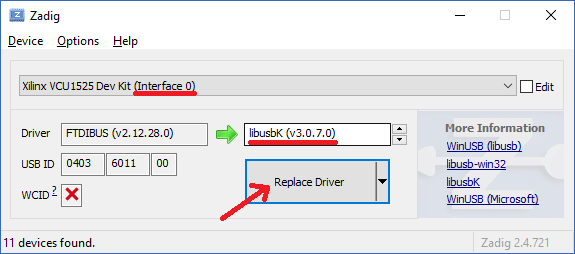

# NextJTAG

NextJTAG is a standalone command line utility used for accessing Xilinx FPGAs over USB.  It supports basic operations, such as checking the temperature and loading bitstreams.  Platform and FPGA support are fairly limited, but more are coming soon.  To gain access to all features, a [license](#Licensing) must be purchased.  Check the [releases](../../releases) to download the latest binaries.

## Supported Features

* Querying Device DNAs of attached FGPAs
* Loading bitstreams in parallel (not persistent across power cycling)
* Clearing the currently loaded bitstream
* Reloading the bitstream from flash
* Reading the min, max, and current temperature and voltage
* Reading/writing XADC/SYSMON registers
* Changing voltage controller settings (BCU1525 only, see [limitations](#limitations))
* Querying sensors from the BMC (BCU1525 only, see [limitations](#limitations))

## Supported Xilinx FPGAs

* XCVU9P
  * Xilinx VCU1525
  * SQRL BCU1525
  * Bittware BTU9P
  * Huawei FX600 (requires FTDI/JTAG cable)
* XCVU13
  * Bittware CVP13
* Other
  * SQRL Acorns (requires FTDI/JTAG cable)
  * Trustfarm TM-FM2L (requires FTDI/JTAG cable)

## Limitations

* General
  * Requires USB to be connected to an onboard FTDI chip or an external FTDI/JTAG cable)
  * Regular temperature and voltage readings use XADC/SYSMON, which may not give the same value as sensors elsewhere on the board.  In addition, some bitstreams seem to break the min/max functionality on the temperature and voltage sensors.
  * There is not a way to run different operations on different devices in the same command.  NextJTAG will need to be called multiple times.
  * Many advanced operations (such as changing the voltage) requires BMC access, which is different for every board.  We currently only support BMC operations on the BCU1525, but may add more in the future depending on demand and vendor cooperation.
* BCU1525
  * BMC access requires loading a special bitstream, which takes a few second and causes the previous bitstream to be overwritten.  This means that setting the voltage or reading BMC sensors can't be done while mining.
  * NextJTAG will refuse to set voltage on an out of date BMC (this is shown as error 0x6d)

## Supported Platforms

* Linux (x86-64)
* Windows (x64)

## Licensing

Licensing is done per FPGA and is tied to the FPGA's Device DNA (a unique identifier fused into the chip by the manufacturer).  The majority of features require a license to use.  The only feature that does not require a license is to list the Device DNAs of all FPGAs connected to the system.

Licenses are stored in a text file(s), with each line specifying the Device DNA and associated license separated by whitespace.  Blank lines and lines starting with `#` are ignored.  There are two ways to use license files:

1. If the `NEXTJTAG_LICENSE` environment variable is set, NextJTAG will use the value as the (relative or absolute) path to the license file.  Multiple files can be set using a colon (Linux) or semicolon (Windows) separated list.
2. If the environment variable is not set, then NextJTAG will automatically use any txt file that starts with `nextjtag_license` that is in the current directory or in the directory where the NextJTAG tool is located in.  For example, `nextjtag_license_foo.txt` would be matched.

Licenses must be purchased from NextDesign Solutions directly or through an authorized third party vendor ([see purchasing options](#purchasing-options)).  Licenses are valid indefinitely, but will only work with the same major version of NextJTAG.  For example, a 1.x license will work with versions 1.0 and 1.1, but will not with version 2.0.  In general, bug fixes and basic new features will not result in a major version bump.


### Purchasing options

* [fpga.guide](https://shop.fpga.guide/collections/all/products/nextjtag-license) (Paypal, Credit Card, or various crypto currencies)
* Contact `turekaj#2845` on discord (Ethereum only)

## Permissions (Linux only)

NextJTAG needs access to the FTDI chip on the FPGA over USB in order to work, which requires special permissions on Linux platforms.  There are two options:
1. Run as root user (not ideal, but convenient)
2. Install udev rules to allow non-root users access to read and write to USB FTDI devices (best practice)

To do option 2, simply copy the `.rules` files from the release (located in `<release>/lib/udev/rules.d`) into the `/etc/udev/rules.d` directory on your system.  However, the rule will only apply to new USB connections.  If you already have a FPGA connected over USB, you can manually trigger the rule by running `udevadm trigger --action=add` as root.

## Driver Install (Windows only)

NextJTAG supports two drivers: a proprietary FTDI driver from the manufacturer and an open source driver.  Only one driver needs to be used.

### Proprietary FTDI driver (default for Windows)

Most other tools and miners, including Vivado, use this driver, so using this with NextJTAG ensures maximum interoperability.  If the driver isn't already installed, it can be found [here](https://www.ftdichip.com/Drivers/D2XX.htm) (there is a Windows installer if you search for "setup executable" on that page).

Once the driver is installed, you should be able to run NextJTAG without any arguments, and see a list of your FPGAs.

### Open Source FTDI driver (advanced users only)

The open source driver is around for legacy reasons, and not recommended for most users.  The open source driver will need to be configured for the FTDI interfaces that NextJTAG uses (Interface 0 for JTAG, Interface 2 for BMC control).

1. (optional) Installed the Install the [proprietary driver](#proprietary-ftdi-driver-default-for-windows).  This will create a clean slate, and will use the proprietary driver as default the for all interfaces for the FTDI chip.  If you are already using Vivado, this is probably not necessary
2. Download the [zadig](https://zadig.akeo.ie/) tool and run it as administrator.  This is a convenient tool to for installing drivers compatible with `libusb`
3. In Zadig, select `Options > Show all devices`, and then use the dropdown to select Interface 0 for one of your FPGA cards.  On the line below the dropdown, select `libusbK` and then hit the `Replace Driver` button.  Repeat for Interface 0 for all of your FPGA cards.  Do not replace the driver for the other interfaces, since some miners require the proprietary driver for those to work.
4. (optional) If you require BMC control on the BCU1525, repeat step 3 for Interface 2 for all FPGA cards.  This may prevent USB based miners from working, so you might need to switch it back after the BMC is configured.



The changes made by Zadig will be persistent, even after reboots.  To remove the open source driver, just install the proprietary driver again from step 1.  **You will need to do this in order to use Vivado again after running these steps**

In order to tell NextJTAG to use the open source driver, the `--prefer_libftdi` must be passed on the command line.

## Usage

To list all FGPAs detected on the system, run `nextjtag` without any arguments.  This does not require a license, so it is a good way to test the permissions and drivers are setup correctly on your system before buying a license.

All other usages of `nextjtag` require a license.  It is required that you specify at least one arugment that is a "Device Selector" (to specify which devices to use) and at least one argument that is a "Command" (to specify what you want to do).  If multiple commands are given, the comamnds will be executed in the order given.  If multiple device selectors are given, then all commands will be executed on the selected devices.

Here is the list of all the options (you can also run `nextjtag -h` to see the same output):

```
Usage: nextjtag [OPTIONS]

Options:
  -h,--help                   Print this help message and exit
  --version                   Display the version of this tool and exit
  -m,--multithread            Enables multi threaded mode, with one thread per FGPA
  --max-threads COUNT         Limits how many threads will be run concurrently in multithreaded mode


Device Selectors:
  -a,--all                    Selects all detected devices
  -f,--fpga FPGA              Select all devices using the given FPGA
  -d,--device INDEX           Select device to use by index
  -j,--serial SERIAL          Select device to use by FTDI serial number
  -k,--dna DNA                Select device to use by FPGA DNA


Commands:
  -t,--temperature            Performs a read of temperature sysmon/xadc registers
  -v,--voltage                Performs a read of voltage sysmon/xadc registers
  -s,--sysmon OP              Performs a read or write (if value is given) operation to a
                              sysmon/xadc register.
                              OP: <reg>[:<value>]
  -e,--extended LIST          Reads a comma separated list of extended sensors from the BMC. List of
                              supported sensors is board specific; use "all" to read all sensors. On
                              some boards, such as the BCU1525, this operation will clear the
                              currently loaded bitstream.
  -c,--clear                  Performs a clear operation, which clears the existing bitstream from
                              CFG mem (not persistent)
  -r,--reload                 Performs a reload operation, which reloads the bitstream from flash
  -b,--bitstream PATH:FILE    Performs a program operation, which loads a bitstream (.bit or .bin)
                              file into CFG mem (not persistent)
  -w,--wait SECONDS           Pauses for the given seconds after the previous operation


Expert Options:
  --set-voltage VOLTAGE       Changes the FPGA core voltage through the BMC (not persistent).
                              WARNING: INCORRECT VALUES CAN CAUSE PERMANENT DAMAGE TO YOUR FPGA!
                              This option will also clear the current bitstream, so make sure to
                              reprogram it afterwards. Voltage is programatically limited to 0.64V
                              to 0.95V, but each FPGA is unique and may not function across the
                              entire range. Only supported board is BCU1525; this option is ignored
                              for all other boards.
  --disable-voltage-limit     Disables artificial voltage limits of the --set-voltages option. Not
                              recommended, only for the brave or the stupid.
  --prefer-libftdi            Uses open source FTDI driver for JTAG communication (default for
                              Linux)
  --prefer-ftd2xx             Uses proprietary FTDI driver for JTAG communication (default for
                              Windows)
  --force-ftd2xx-reload       Forcibly unloads and reloads the proprietary FTDI driver in Windows
                              and exits. This an experimental method to recover USB devices that are
                              stuck and no longer visible to the driver. For best results, close any
                              other programs that use USB to communicate with the FPGA before
                              running this.  Must be run as Administrator.
```

## Examples

Query Device DNAs from all attached devices (no license required):

```
$ nextjtag
List of available devices:
  0: CB-U1-AEBE (serial: 21440289L034, FPGA: XCVU9P, DNA: 400200000128a7072d60e145)
  1: CB-U1-AEBE (serial: 21430289400C, FPGA: XCVU9P, DNA: 400200000117ab290d3102c5)
  2: CB-U1-AEBE (serial: 21440289K059, FPGA: XCVU9P, DNA: 40020000012922a7151121c5)
```

Read the temperature, wait 5 seconds, read the temperature again, and finally read voltage from device 0:
```
$ nextjtag -d0 -t -w5 -t -v
[2019-03-24 06:52:58] Device 0: Temperature: 24.1647°C (min), 25.6568°C (current), 26.1542°C (max)
[2019-03-24 06:52:58] Device 0: Sleeping: 5 seconds
[2019-03-24 06:53:03] Device 0: Temperature: 24.1647°C (min), 24.6621°C (current), 26.1542°C (max)
[2019-03-24 06:53:03] Device 0: Voltage: 0.7939V (min), 0.7969V (current), 0.7998V (max)
```

Program bitstream for all XCVU9P FPGAs in parallel:
```
$ nextjtag -m -f xcvu9p -b vcu1525_keccak_21_600.bit
[2019-03-24 06:53:59] Device 1: Programming bitstream: STARTING...
[2019-03-24 06:53:59] Device 2: Programming bitstream: STARTING...
[2019-03-24 06:53:59] Device 0: Programming bitstream: STARTING...
[2019-03-24 06:54:39] Device 0: Programming bitstream: SUCCESS
[2019-03-24 06:54:39] Device 1: Programming bitstream: SUCCESS
[2019-03-24 06:54:39] Device 2: Programming bitstream: SUCCESS
```

Set voltage for device with Device DNA of 400200000117ab290d3102c5 (BCU1525 only, requires v2.0+):
```
$ nextjtag -k 400200000117ab290d3102c5 --set-voltage=0.72
[2019-01-30 02:10:15] Device 0: Changing voltage: STARTING...
[2019-01-30 02:10:23] Device 0: Changing voltage: SUCCESS
```

Read VCCINT and Voltage Regulator Controller Temperature from the BMC (BCU1525 only, requires v2.1+)
```
$ nextjtag -a -m -e vccint,vr_ctrl_temp
[2019-03-24 07:01:44] Device 2: Extended Sensors: STARTING READ...
[2019-03-24 07:01:44] Device 1: Extended Sensors: STARTING READ...
[2019-03-24 07:01:44] Device 0: Extended Sensors: STARTING READ...
[2019-03-24 07:01:54] Device 2: Extended Sensors: vccint = 0.8500, vr_ctrl_temp = 37.0000
[2019-03-24 07:01:54] Device 1: Extended Sensors: vccint = 0.8010, vr_ctrl_temp = 35.0000
[2019-03-24 07:01:54] Device 0: Extended Sensors: vccint = 0.8010, vr_ctrl_temp = 35.7500
```

## Troubleshooting

How to fix some common problems.

#### No devices available or missing devices

```
$ nextjtag
List of available devices:
  (No devices found)
```

Check that your FPGAs are plugged in.  On Linux, you can do `lsusb` and search for FT4232H or "Future Technology Devices International" (FTDI).  On Windows, check device manager, and make sure you have gone through the [driver install](#driver-install-windows-only).

If it was previously working on Windows, but devices are not showing up now, then sometimes the FTDI driver gets stuck and prevents NextJTAG from opening deivces.  You can try running NextJTAG with the experimental `--force_ftd2xx_reload` option to attempt to get it unstuck.  If that doesn't work, you can try unplugging and plugging the device back in, or rebooting.

#### Unable to open device (no device name)

```
$ nextjtag
List of available devices:
  0:  (serial: , Unable to open device (0x10))
  1:  (serial: , Unable to open device (0x10))
  2:  (serial: , Unable to open device (0x10))
```

On Linux, this is probably a [permission](#permissions-linux-only) problem.  Try running as root or installing udev rules.

On Windows, this might be a [driver](#driver-install-windows-only) issue.  Sometimes a reboot will help.

#### Unable to open device (with device name)

```
$ nextjtag
List of available devices:
  0: CB-U1-AEBE (serial: 21440289L034, FPGA: XCVU9P, DNA: 400200000128a7072d60e145)
  1: CB-U1-AEBE (serial: 21430289400C, Unable to open device (0x10))
  2: CB-U1-AEBE (serial: 21440289K059, FPGA: XCVU9P, DNA: 40020000012922a7151121c5)
```

The device is probably already open by another process.  Check for other instances of NextJTAG that are running.  Also check if Vivado is running, and if so, make sure it isn't connected to the FPGA.  If that doesn't work, you can try rebooting.

#### Unable to initialize device

```
$ nextjtag
List of available devices:
  0: Digilent USB Device (serial: 210241433626, Unable to initialize FPGA (0x54))
```

This means that it was able to open the device, but it received something unexpected from the FTDI chip.  For example, this can happen if you use NextJTAG with a non-supported FPGA.  This can also indicate a hardware issue, when the FPGA is not responding to JTAG scan requests.  In some cases, power cycling may fix the issue.

#### Bogus min/max temperatures

```
$ nextjtag -a -t
[2019-03-24 07:14:37] Device 0: Temperature: 228.5866°C (min), 25.1594°C (current), -280.2300°C (max)
```

This is a known issue with certain hardware/bitstream configurations, and something we can hopefully provide a workaround for in the future.

#### Weird characters being printed out for temperature command

This is probably an issue with your shell not rendering the degree symbol, which requires UTF-8 encoding.

On Windows, run `chcp 65001` in the command prompt or `[Console]::OutputEncoding = [System.Text.Encoding]::UTF8` in powershell.

On Linux, it depends on your terminal program.

#### Error 0x6d when setting the voltage

```
$ nextjtag -a --set-voltage 0.8
[2019-03-24 07:18:06] Device 0: Changing voltage to 0.80V: STARTING...
[2019-03-24 07:18:16] Device 0: Changing voltage to 0.80V: ERROR (0x6d)
```

This means the BMC version is out of date. The instructions to update the BMC firmware for BCU1525 cards is [here](https://miner.all-mine.co/instructions/guides/updating-bcu1525-bmc-firmware).
